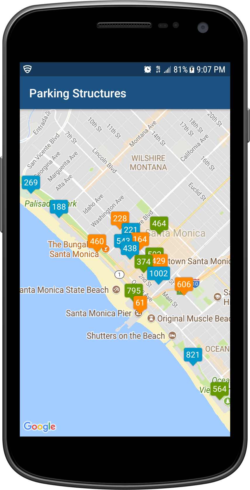

# SM Parking

## Overview
SM Parking allows you to see available parking spaces in real time from 18 structures and beach parking lots in Santa Monica, including the famous Santa Monica Pier.

## Libraries
- Google Map API
- Google Map Android API Utility
- RxJava2
- Retrofit2

## Screenshots

